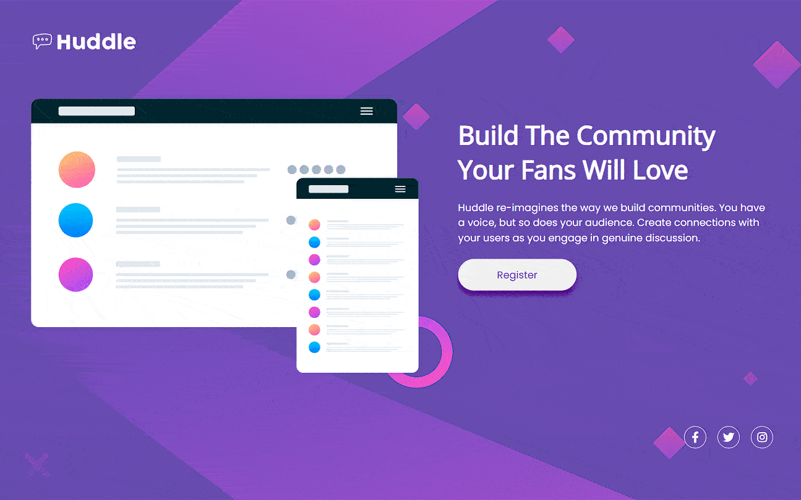
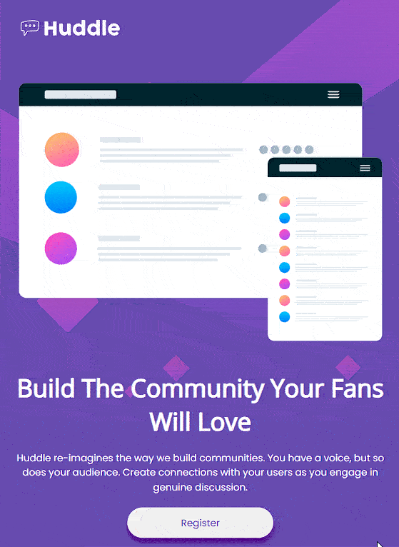
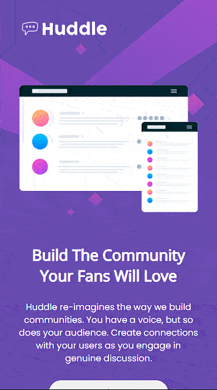

# Frontend Mentor Challenge | Huddle Landing Page


#### Este é um modelo de landing page contendo alguns elementos de interação e visual.

## Índice

- [Capturas de telas](#capturas-de-telas)
- [Links](#links)
- [Construído com](#construído-com)
- [O que aprendi](#o-que-aprendi)
- [Desenvolvimento contínuo](#desenvolvimento-contínuo)
- [Recursos úteis](#recursos-úteis)
- [Luis Fernando Guimaraes](#autor)

### Capturas de telas

#### Tela Desktop



#### Tela Ipad



#### Tela Mobile



### Links

- Site URL: https://luis92guimaraes.github.io/huddle-landing-page/

### Construído com

<div style="display: inline_block"><br>
  
       
</div>

### O que aprendi

Esse exercicio é proposto dentro do site @Frontend Mentor, foi um exercício que também foi proposto como desafio dentro do modulo de CSS avançado da Devquest, curso de desenvolvedor web full stack com mentoria do @devemdobro. Esse desafio me ajudou a fixar os conhecimentos que adquiri até o momento com o HTML e CSS e estou feliz com o resultado!

## Trechos de códigos

```
.info .btn {
    align-self: flex-start;
    color: var(--bg-color);
    font-family: 'Poppins', sans-serif;
    font-size: 1.8rem;
    padding: 15px 70px;
    border-radius: 30px;
    box-shadow: 0px 8px 10px  indigo;
    transition: 0.1s ease-in-out;
}

.info .btn:hover{
    color: #fff;
    background-color: var(--hover-color);
}

.social {
    display: flex;
    justify-content: flex-end;
    align-items: center;
    gap: 20px;
    margin-top: 90px;
}
```

### Desenvolvimento contínuo

Pretendo continuar aprendendo cada vez mais sobre as ferramentas utilizadas nesse projeto, ainda tem muita coisa pra ser absorvida mas sigo confiante e feliz em estar conseguindo tornar meu conhecimento solido e poder realizar projetos como esse com mais clareza e confiança a cada dia de estudos.

### Recursos úteis

- [Mdn](https://developer.mozilla.org/en-US/) - O Mozilla Developer Network (MDN) desempenha um papel crucial ao fornecer recursos abrangentes e atualizados para desenvolvedores web em todo o mundo.
- [W3School](https://www.w3schools.com/css/default.asp) - Esse site sempre me ajuda a resolver qualquer problema relacionados a códigos de uma maneira fácil e muito rápida.
- [Dev em Dobro](https://www.youtube.com/@DevemDobro) - Este é um canal onde encontro muito material. Tem muito conteúdo relacionado ao desenvolvimento. Recomendo a todos que querem aprender sobre esse e outros conceitos relacionados.

## Autor

[Luis Fernando Guimarães](https://www.linkedin.com/in/luisfguimaraes/)
